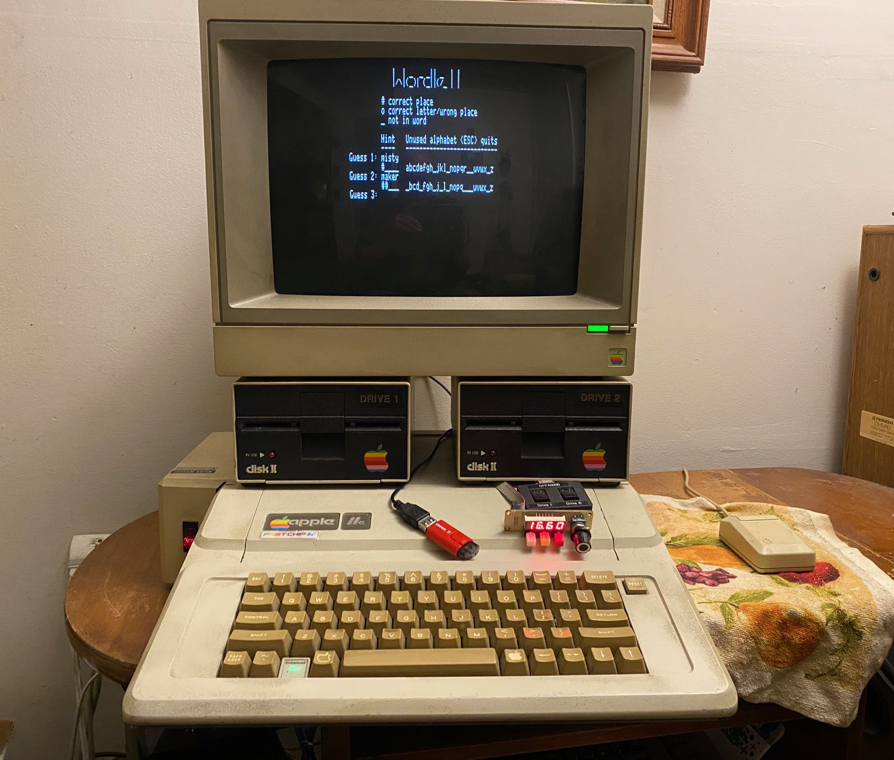
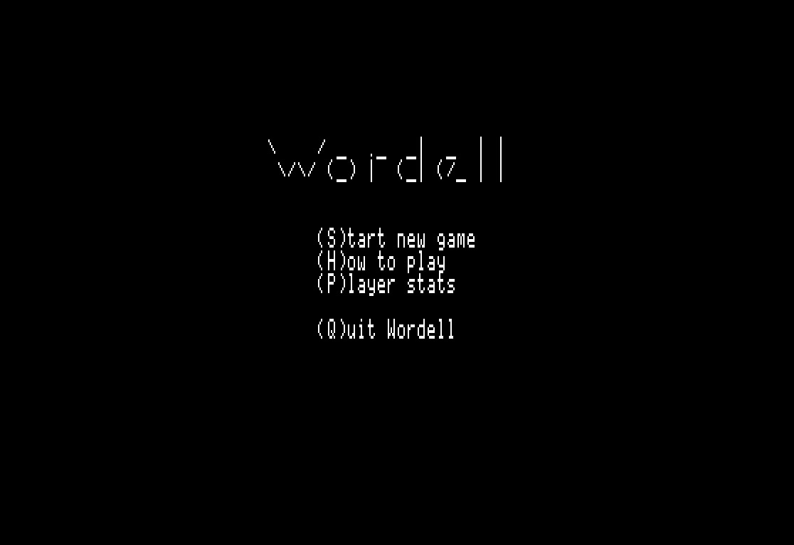
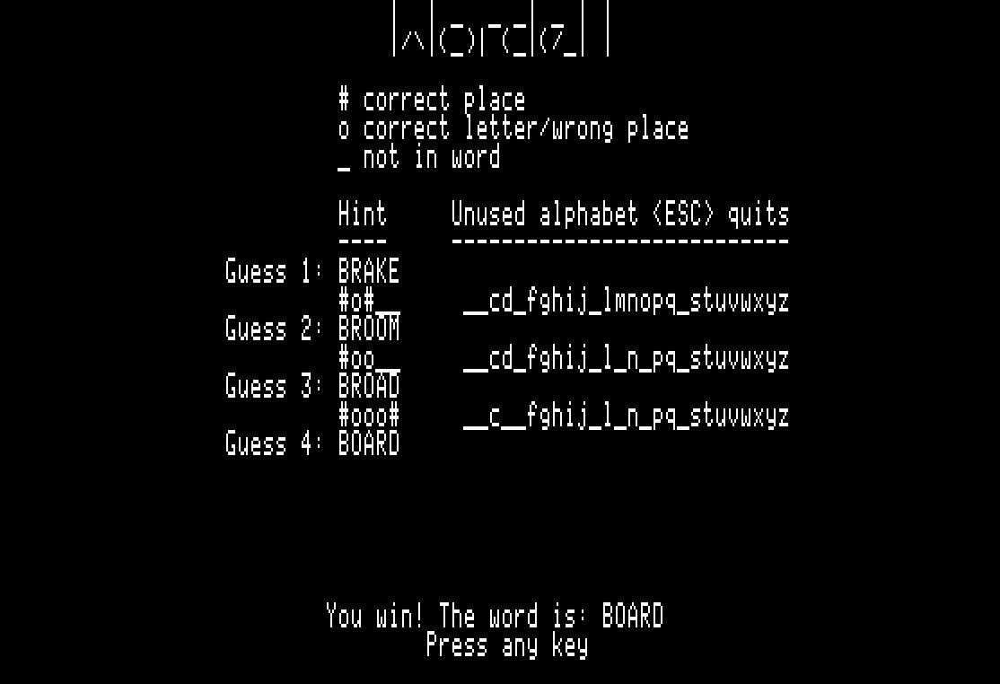
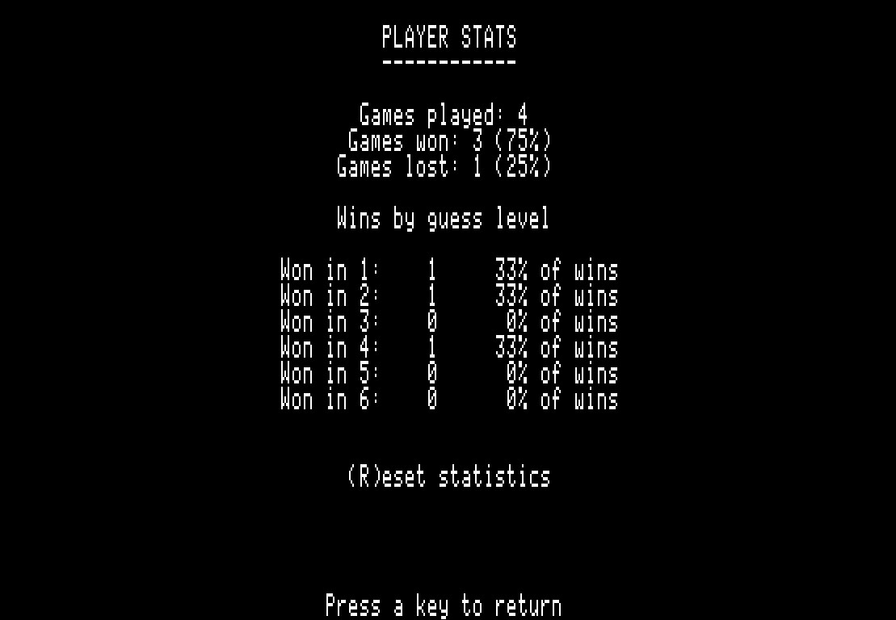

## Wordell: A Wordle Clone for Apple II

Wordell is a Wordle clone for Apple II written in
[CC65](https://cc65.github.io/doc/apple2.html) and Assembly.
It features 2,315 possible unique games. It requires 64kb and an
80 column card. File system is [ProDOS 2.4.3](https://prodos8.com/).
The main target is Apple //e. It may work on a ][+ with an 80 column
card, but that hasn't been tested. All testing was done on real
hardware running
[Apple II Desktop](https://www.a2desktop.com/).

### Shoutout to other Apple II Wordle clones on Github (they're great):
[Untitled Word Game Pro](https://github.com/a2-4am/untitled-word-game-pro)
by 4am

[Apple IIe Wordle - wordle6502](https://github.com/jeffjet24/wordle-6502) by jeffjet24

## And now on to Wordell...

## Screenshots

<table>
    <tr>
        <td align="left" width="50%" valign="middle">
            <br>
        </td>
        <td align="left" width="50%" valign="middle">
            <br>
        </td>
    </tr>
    <tr>
        <td align="left" width="50%" valign="middle">
            <br>
        </td>
        <td align="left" width="50%" valign="middle">
            <br>
        </td>
    </tr>
</table>

## How Wordell Works

Wordell uses two word lists:

- `ALL.TXT` - 12,947 words accepted as guesses.
- `SOLUTION.TXT` - 2,315 words that can be selected as answers.

The Apple II does not read these text files directly. They
are converted on a modern PC into fixed 5-byte records.

At startup Wordell opens `ALL5.BIN` and `SOL5.BIN`. Pressing **S**
starts a timer-based random seed. A solution number is selected and
exactly five bytes are read from `SOL5.BIN`.

Guess validation is kept small and fast. Only the matching first-letter
group from `ALL5.BIN` is loaded into RAM. `FASTWORD.S` then searches
that RAM buffer in 6502 assembly.

Hints use:

- `#` - correct letter and position
- `o` - correct letter, wrong position
- `_` - letter not in the word

Used letters are removed from the visible
alphabet as the game progresses.

### Player Stats

Player stats are recorded in `WORDLE.INI` at the end
of each game. These can be reset to zero at any time.

## Building the Word Files

### You don't need to do this unless you wish to make new word/solution lists.

`MAKEPACK.C` is a Windows tool. It converts the normal
text word lists into the files used by the Apple II
version.

It reads:

```text
ALL.TXT
SOLUTION.TXT
```

It writes:

```text
ALL5.BIN
SOL5.BIN
WORDDATA.H
```

Each packed word is exactly five bytes. No
CR, LF, or zero terminator is stored.

`WORDDATA.H` is generated at the same time. It contains
the solution count plus the offset and size of each
starting-letter group in `ALL5.BIN`.

`ALL.TXT` must remain grouped by starting letter.
`MAKEPACK.C` packs the list as supplied; it does
not sort it.

## Future Considerations for Wordell

I know, I know... why not 40 columns? I just like 80, that's all.
I guess mode-switching is one idea, but it could get tricky unless
Wordell always starts in 40 column mode, and I prefer the "80" look.

The repositioning would be easy. If Wordell could detect the screen
mode and then auto-adjust, that would be fantastic. Maybe that'll be
version 2.0.
